@lab.Title

## Welcome to Your Lab Environment

To begin, log into the virtual machine using the following credentials: +++@lab.VirtualMachine(Win11-Pro-Base).Password+++

**Note:** Text formatted as an +++example+++ represents type text. Clicking on this text will automatically insert it to prevent any typing errors.

===

# Exercise: Introduction & Environment Setup

## Goal
Set up your development environment, clone the workshop repository, and configure Azure AI Foundry connectivity to prepare for the agent evaluation exercises.

## Learning Objectives
- Clone and open the workshop repository
- Understand the solution structure
- Configure Azure AI Foundry credentials
- Verify the Aspire AppHost starts successfully

## Prerequisites
- **Visual Studio 2026 18.0+** or **Visual Studio Code** with the C# Dev Kit extension
- **.NET 10 SDK** installed
- **Docker Desktop** running (required for Aspire)
- An **Azure subscription** with access to Azure AI Foundry
- **Git** installed and configured

> [+hint] 📚 **Documentation Links:**
>
> [.NET 10 SDK Download](https://dotnet.microsoft.com/download/dotnet/10.0)
>
> [Visual Studio 2026](https://visualstudio.microsoft.com/vs/)
>
> [Docker Desktop](https://www.docker.com/products/docker-desktop/)
>
> [Azure AI Foundry Overview](https://learn.microsoft.com/en-us/azure/ai-studio/what-is-ai-studio)

## Clone the Repository

Choose one of the following methods to clone the workshop repository.

### Option A: Using Terminal / Command Line

1. [ ] Open a terminal or command prompt
1. [ ] Run the following commands:

    ```bash
    git clone https://github.com/seiggy/agent-unit-testing.git
    cd agent-unit-testing
    ```

1. [ ] Login to Azure CLI: `az login`
- Username: ++@lab.CloudPortalCredential(User1).Username++
- Password: ++@lab.CloudPortalCredential(User1).Password++
- AccessToken: ++@lab.CloudPortalCredential(User1).AccessToken++

### Option B: Using Visual Studio Code

1. [ ] Open VS Code
1. [ ] Click the `Connect` button on the Get Started page to login with your credentials:
    - Username: ++@lab.CloudPortalCredential(User1).Username++
    - Password: ++@lab.CloudPortalCredential(User1).Password++
    - AccessToken: ++@lab.CloudPortalCredential(User1).AccessToken++
1. [ ] Press ++Ctrl+Shift+P++ (or ++Cmd+Shift+P++ on macOS) to open the Command Palette
1. [ ] Type **Git: Clone** and select it
1. [ ] Paste the repository URL: ++https://github.com/seiggy/agent-unit-testing++
1. [ ] Choose a local folder to clone into
1. [ ] When prompted, click **Open** to open the cloned repository


### Option C: Using Visual Studio 2026

1. [ ] Open Visual Studio 2026
1. [ ] On the start window, select **Clone a repository**
1. [ ] Enter the repository URL: ++https://github.com/seiggy/agent-unit-testing++
1. [ ] Choose a local path and click **Clone**
1. [ ] Visual Studio will automatically open the solution

## Open the Solution

1. [ ] Open the ++AgentEvalsWorkshop.sln++ solution file located in the root of the cloned repository
1. [ ] Familiarize yourself with the solution structure:

> [!knowledge] Solution Structure
> 
> | Project | Purpose |
> |---------|---------|
> | ++AgentEvalsWorkshop++ | Main application containing agent definitions |
> | ++AgentEvalsWorkshop.AppHost++ | .NET Aspire orchestration host |
> | ++AgentEvalsWorkshop.ServiceDefaults++ | Shared service configuration |
> | ++AgentEvalsWorkshop.Tests++ | Integration tests with AI evaluators |

## Start the Aspire AppHost

The Aspire AppHost orchestrates the application and its dependencies, including the Azure AI Foundry connection.

### Using Visual Studio 2026

1. [ ] In **Solution Explorer**, right-click on ++AgentEvalsWorkshop.AppHost++
1. [ ] Select **Set as Startup Project**
1. [ ] Press ++F5++ or click the **Start** button to run
1. [ ] The Aspire Dashboard will open in your default browser

### Using Terminal / VS Code

1. [ ] Open a terminal in the repository root
1. [ ] Run the following command:

```bash
dotnet run --project src/AgentEvalsWorkshop.AppHost
```

> [!knowledge] Dashboard URL
> 
> The terminal will display a URL for the Aspire Dashboard (typically ++https://localhost:17208++ or similar). Open this URL in your browser.

## Configure Azure AI Foundry Credentials

When the Aspire Dashboard opens, you'll need to provide your Azure subscription credentials to connect to Azure AI Foundry.

### Input Credentials in Aspire Dashboard

1. [ ] In the Aspire Dashboard, locate the ++set parameters++ button in the top-right corner.
1. [ ] Use the following values to setup your resources:
    - Subscription Id:
    - Resource Group: ++@lab.CloudResourceGroup(ResourceGroup1).Name++
    - Foundry Deployment Name: ++@lab.CloudResourceTemplate(Lab182-Template).Outputs[aiFoundryApiEndpoint]++
    - Model Deployment Name: ++chat++

### Alternative: Configure via User Secrets

> [!knowledge] User Secrets
> 
> If you prefer to configure credentials outside the dashboard, use .NET User Secrets for a more persistent configuration.

1. [ ] Open a terminal and navigate to the AppHost project:

```bash
cd src/AgentEvalsWorkshop.AppHost
```

1. [ ] Set your Azure credentials using the following commands:

```bash
dotnet user-secrets set "Azure:SubscriptionId" "<your-subscription-id>"
dotnet user-secrets set "Azure:ResourceGroup" "<your-resource-group>"
dotnet user-secrets set "Azure:AIFoundry:Endpoint" "<your-foundry-endpoint>"
```

1. [ ] Restart the AppHost after configuring secrets

### Verify Connection

1. [ ] In the Aspire Dashboard, verify the ++chat++ resource transitions to a **Running** (green) state
1. [ ] Verify the ++agents++ resource shows as **Healthy**

> [+hint] 📚 **Documentation Links:**
>
> [.NET Aspire Dashboard](https://learn.microsoft.com/en-us/dotnet/aspire/fundamentals/dashboard/overview)
>
> [Managing User Secrets](https://learn.microsoft.com/en-us/aspnet/core/security/app-secrets)
>
> [Azure AI Foundry Setup](https://learn.microsoft.com/en-us/azure/ai-studio/quickstarts/get-started-playground)

## Verify Your Setup

Run a quick smoke test to ensure everything is configured correctly.

1. [ ] Open a new terminal in the repository root
1. [ ] Run the configuration smoke test:

```bash
dotnet test tests/AgentEvalsWorkshop.Tests --filter "FullyQualifiedName~ConfigurationSmokeTests"
```

1. [ ] Verify the test passes

> [!knowledge] Success Indicators
> 
> A passing test confirms:
> - ✅ Aspire AppHost starts successfully
> - ✅ Azure AI Foundry connection is established
> - ✅ Chat client can be resolved from the service provider

## Troubleshooting

> [!alert] Common Issues
> 
> | Symptom | Possible Cause | Resolution |
> |---------|----------------|------------|
> | AppHost fails to start | Docker not running | Start Docker Desktop and wait for it to be fully running |
> | ++chat++ resource stays in "Starting" | Missing or invalid Azure credentials | Verify Subscription ID and Foundry endpoint in user secrets or dashboard |
> | Connection timeout | Network/firewall issues | Ensure outbound access to Azure services; check VPN settings |
> | "Subscription not found" error | Incorrect Subscription ID | Double-check the ID in Azure Portal under Subscriptions |
> | Dashboard doesn't open | Port conflict | Check terminal output for the actual dashboard URL |

## Success Criteria

You're ready to proceed to the exercises when:

- [ ] Repository is cloned and solution opens without errors
- [ ] Aspire AppHost starts and the dashboard is accessible
- [ ] Azure credentials are configured (via dashboard or user secrets)
- [ ] The ++chat++ and ++agents++ resources show as Running/Healthy in the dashboard
- [ ] Configuration smoke tests pass


Once your environment is set up, proceed to the next exercise below.

===

# Exercise: TaskAdherenceEvaluator

## Goal
Create a test class that uses the **TaskAdherenceEvaluator** to evaluate how well an AI agent accomplishes a given task. You will build a Weather Assistant Agent test that verifies the agent correctly uses its available tools to respond to user requests.

## Learning Objectives
- Understand how to configure AI evaluation reporting
- Learn to use the _TaskAdherenceEvaluator_ to measure agent performance
- Practice writing integration tests for AI agents
- Interpret evaluation metrics and assertions

## Prerequisites
- Aspire AppHost configured run once
- Solution open in Visual Studio 2026 or VS Code
- Azure Foundry endpoint configured in user secrets or environment variables

## Key Concepts

The **TaskAdherenceEvaluator** measures how well an AI agent follows instructions and uses its available tools to complete a task. It examines:
- Whether the agent called the appropriate tools
- Whether the agent's response aligns with the task requirements
- The quality of the agent's tool usage decisions

📚 **Documentation Links:**
- [TaskAdherenceEvaluator Documentation](https://learn.microsoft.com/en-us/dotnet/api/microsoft.extensions.ai.evaluation.quality.taskadherenceevaluator?view=net-10.0-pp)
- [AI Evaluation Library Overview](https://learn.microsoft.com/en-us/dotnet/ai/evaluation/libraries)

## Create the Test Class

1. [ ] Create a new file **WeatherAssistantAgentTests.cs** in the **tests/AgentEvalsWorkshop.Tests/** project.

1. [ ] Add the necessary **using** directives for the ++AgentEvalsWorkshop.Agents++ namespace, test helpers, and the ++Microsoft.Extensions.AI.Evaluation++ packages (including `Quality`, `Reporting`, and `Reporting.Storage` namespaces)
1. [ ] Define a test class decorated with ++[TestClass]++ that inherits from ++BaseIntegrationTest++

> [!knowledge] BaseIntegrationTest
> 
> The base class provides a **ServiceProvider**, **ChatConfiguration**, **ScenarioName**, **ExecutionName**, and **Evaluators**
> that will be used in your tests.

> [+hint] 📚 **Documentation Links:**
>
> [MSTest v3](https://learn.microsoft.com/en-us/dotnet/core/testing/unit-testing-mstest-writing-tests)

<details>
<summary>💡 Show Example Implementation</summary>

```csharp
using AgentEvalsWorkshop.Agents;
using AgentEvalsWorkshop.Tests.Helpers;
using Aspire.Hosting;
using Microsoft.Extensions.AI;
using Microsoft.Extensions.AI.Evaluation;
using Microsoft.Extensions.AI.Evaluation.Quality;
using Microsoft.Extensions.AI.Evaluation.Reporting;
using Microsoft.Extensions.AI.Evaluation.Reporting.Storage;
using System;
using System.Collections.Generic;
using System.Text;

namespace AgentEvalsWorkshop.Tests;

[TestClass]
public class WeatherAssistantAgentTests : BaseIntegrationTest
{
    // Fields and methods will be added in subsequent steps
}
```

</details>


##  Add the Reporting Configuration

1. [ ] Declare a static nullable field of type ++ReportingConfiguration++ to store the evaluation reporting configuration
> [!knowledge] This field will be initialized during class setup and shared across all tests in the class

> [+hint] 📚 **Documentation Links:**
>
> [Evaluate with Reporting Learn Tutorial](https://learn.microsoft.com/en-us/dotnet/ai/evaluation/evaluate-with-reporting)

<details>
<summary>💡 Show Example Implementation</summary>

```csharp
private static ReportingConfiguration? s_defaultReportingConfiguration;
```

</details>

##  Create the Evaluators Factory

1. [ ] Create a *private static* method named ++GetEvaluators++ that returns `IEnumerable<IEvaluator>`
1. [ ] Instantiate a new **TaskAdherenceEvaluator** and return it in a collection
> [!knowledge] This method encapsulates which evaluators your tests will use

> [+hint] 📚 **Documentation Links:**
>
> [Sample Agent Evaluator Unit Tests](https://github.com/dotnet/extensions/blob/main/test/Libraries/Microsoft.Extensions.AI.Evaluation.Integration.Tests/AgentQualityEvaluatorTests.cs)

<details>
<summary>💡 Show Example Implementation</summary>

```csharp
private static IEnumerable<IEvaluator> GetEvaluators()
{
    var taskAdherenceEvaluator = new TaskAdherenceEvaluator();
    return [ taskAdherenceEvaluator ];
}
```

</details>

## Implement Class Initialization

1. [ ] Add a `public static async Task` method decorated with `[ClassInitialize]` that accepts a `TestContext` parameter
1. [ ] Assign the result of `GetEvaluators()` to the inherited `Evaluators` property
1. [ ] Use `DiskBasedReportingConfiguration.Create()` to configure reporting with:
  - A `storageRootPath` for persisting HTML reports (e.g., `C:\TestReports`)
  - Your `Evaluators` collection
  - The inherited `ChatConfiguration` for evaluator LLM calls
  - `enableResponseCaching` set to `true` for deterministic reruns
  - The inherited `ExecutionName` to group test runs

> [+hint] 📚 **Documentation Links:**
>
> [Unit Testing Lifecycles](https://learn.microsoft.com/en-us/dotnet/core/testing/unit-testing-mstest-writing-tests-lifecycle#class-level-lifecycle)
>
> [DiskBasedReportingConfiguration Documentation](https://learn.microsoft.com/en-us/dotnet/api/microsoft.extensions.ai.evaluation.reporting.storage.diskbasedreportingconfiguration?view=net-10.0-pp)

<details>
<summary>💡 Show Example Implementation</summary>

```csharp
[ClassInitialize]
public static async Task ClassInitialize(TestContext context)
{
    Evaluators = GetEvaluators();
    s_defaultReportingConfiguration = DiskBasedReportingConfiguration.Create(
            storageRootPath: "C:\\TestReports",
            evaluators: Evaluators,
            chatConfiguration: ChatConfiguration,
            enableResponseCaching: true,
            executionName: ExecutionName
        );
}
```

</details>

## Write the Test Method

### Arrange
1. [ ] Decorate your method with `[TestMethod]` and make it `public async Task`
1. [ ] Create a `ScenarioRun` by calling `CreateScenarioRunAsync()` on your reporting configuration, passing `ScenarioName` and optional tags (use `await using` for proper disposal)
1. [ ] Create a scoped `IServiceProvider` from the inherited `ServiceProvider` and resolve an `IChatClient`
1. [ ] Build the agent using `US1Agent.BuildUS1Agent()`, passing the chat client
1. [ ] Create a `TaskAdherenceEvaluatorContext` with the agent's tool definitions from `US1Agent.GetToolDefinitions()`

### Act
1. [ ] Define a user message string that should trigger the weather tool (e.g., asking about weather)
1. [ ] Call `agent.RunAsync()` with the message and a cancellation token from `TestContext.CancellationTokenSource`
1. [ ] Call `scenarioRun.EvaluateAsync()` passing:
  - The `Messages` from the agent response
  - The response converted via the `ToChatResponse()` extension method
  - The tool definitions context in the `additionalContext` array
  - The cancellation token

### Assert
1. [ ] Extract the `NumericMetric` from results using `result.Get<NumericMetric>()` with `TaskAdherenceEvaluator.TaskAdherenceMetricName`
1. [ ] Assert that `Interpretation.Failed` is `false` (use the metric's `Reason` as the failure message)
1. [ ] Assert that `Interpretation.Rating` is either `EvaluationRating.Good` or `EvaluationRating.Exceptional`

> [+hint] 📚 **Documentation Links:**
>
> [ScenarioRun Documentation](https://learn.microsoft.com/en-us/dotnet/api/microsoft.extensions.ai.evaluation.reporting.reportingconfiguration.createscenariorunasync?view=net-10.0-pp)
>
> [Evaluator Examples](https://github.com/dotnet/ai-samples/tree/main/src/microsoft-extensions-ai-evaluation/api/evaluation)

<details>
<summary>💡 Show Example Implementation</summary>

```csharp
[TestMethod]
public async Task DoesPersonalAgentRetrieveWeather()
{
    // Arrange
    await using ScenarioRun scenarioRun =
        await s_defaultReportingConfiguration!
        .CreateScenarioRunAsync(ScenarioName,
        additionalTags: ["Weather", "Agent"]);
    using var scope = ServiceProvider!.CreateScope();
    var chatClient = scope.ServiceProvider.GetRequiredService<IChatClient>();
    var agent = US1Agent.BuildUS1Agent(chatClient);

    var toolDefinitionsForTaskAdherenceEvaluator =
        new TaskAdherenceEvaluatorContext(toolDefinitions: US1Agent.GetToolDefinitions());

    // Act
    var userMessage = "What's the weather like today?";
    var response = await agent.RunAsync(userMessage,
        cancellationToken: TestContext!.CancellationTokenSource.Token);

    var result = await scenarioRun.EvaluateAsync(
        messages: response.Messages,
        modelResponse: response.ToChatResponse(),
        additionalContext: [toolDefinitionsForTaskAdherenceEvaluator],
        cancellationToken: TestContext!.CancellationTokenSource.Token);

    // Assert
    NumericMetric taskAdherance = result.Get<NumericMetric>(TaskAdherenceEvaluator.TaskAdherenceMetricName);
    Assert.IsFalse(taskAdherance.Interpretation!.Failed, taskAdherance.Reason);
    Assert.IsTrue(taskAdherance.Interpretation.Rating is EvaluationRating.Good or EvaluationRating.Exceptional);
}
```

</details>

##  Run and Validate

1. [ ] Build the solution to verify there are no compilation errors
1. [ ] Execute the test using the `dotnet test` CLI with a filter for your test class, or use Visual Studio Test Explorer

    ```Powershell
    dotnet test tests/AgentEvalsWorkshop.Tests --filter "FullyQualifiedName~WeatherAssistantAgentTests"
    ```

    @[Click this to run the unit tests][Run Unit Tests]{Powershell}

[Run Unit Tests]:
```Powershell
cd c:\github\agent-unit-testing
dotnet test tests/AgentEvalsWorkshop.Tests --filter "FullyQualifiedName~WeatherAssistantAgentTests"
```

> [+hint] 📚 **Documentation Links:**
>
> [dotnet test](https://learn.microsoft.com/en-us/dotnet/core/tools/dotnet-test-vstest)

## Generate and View the Evaluation Report

1. [ ] After the test completes successfully, use the `aieval` CLI tool to generate an HTML report from the cached evaluation data
1. [ ] Run the following command from the root of your repository to generate a consolidated report:

    ```Powershell
    cd c:\github\agent-unit-testing
    dotnet aieval report -p C:\TestReports -o test-report.html
    ```

    @[Click this to run the test report][AIEval Report]{Powershell}

[AIEval Report]:
```Powershell
cd c:\github\agent-unit-testing
dotnet aieval report -p C:\TestReports -o test-report.html
```

3. [ ] Open `test-report.html` in your browser to view the detailed evaluation results

**What you'll see in the report:**

!IMAGE[weather-agent-eval-report.png](instructions333020/weather-agent-eval-report.png)

- **Breadcrumb Navigation**: Hierarchical path showing All Evaluations → Namespace → Test Class → Test Method with pass/fail counts (e.g., `1/1 [100.0%]`)
- **Trends Panel**: Collapsible section for viewing evaluation trends over time
- **Task Adherence Score**: A highlighted metric card showing the numeric score (e.g., `5`) with a visual indicator of success
- **Metric Details**: Expanded view containing:
  - **Evaluation Reason**: Plain-language explanation of why the score was assigned (e.g., "The response is clear, accurate, and adheres to the instructions by retrieving the weather data...")
  - **Diagnostics**: The evaluator's chain-of-thought reasoning showing step-by-step analysis of tool usage and response quality
- **Metadata Table**: Key-value pairs including:
  - `built-in-eval`: Whether the evaluator is built-in
  - `eval-model`: The model used for evaluation (e.g., `gpt-4o-2024-11-20`)
  - `eval-input-tokens` / `eval-output-tokens` / `eval-total-tokens`: Token usage for the evaluation
  - `eval-duration-ms`: Time taken for the evaluation
- **Conversation Panel**: Collapsible section showing token counts and the full message exchange
- **Diagnostic Data Table**: Cache status, latency, model provider details, and token breakdown for each evaluation call

📚 **Documentation Links:**
- [aieval report tool](https://learn.microsoft.com/en-us/dotnet/ai/evaluation/evaluate-with-reporting#generate-a-report)
- [Interpreting Evaluation Reports](https://learn.microsoft.com/en-us/dotnet/ai/evaluation/libraries#interpret-results)

---

## Success Criteria

A passing test indicates:
- ✅ The agent correctly identified it needed to retrieve weather information
- ✅ The agent called the `GetWeatherForecast` tool
- ✅ The agent's response addressed the user's question
- ✅ Task adherence rating is `Good` or `Exceptional`

---

## Troubleshooting

| Symptom | Possible Cause | Resolution |
|---------|----------------|------------|
| `NullReferenceException` on `s_defaultReportingConfiguration` | `ClassInitialize` didn't run | Verify the `[ClassInitialize]` attribute is present and the method signature is correct |
| `ServiceProvider` is `null` | Assembly initialization failed | Check that `BaseIntegrationTest.BaseInitialize` completed successfully; review Aspire app host logs |
| `ChatConfiguration` throws | Missing or invalid connection string | Verify Azure Foundry credentials in user secrets or environment variables |
| Low task adherence scores | Agent instructions don't align with task | Review the system prompt in `US1Agent.cs`; ensure tool definitions are correctly exposed |
| Report directory empty | Write permission denied | Verify your user has write access to the `storageRootPath` directory |

---

## Extension Challenges

1. **Multiple Evaluators**: Add `RelevanceEvaluator` or `CoherenceEvaluator` to your evaluator collection and observe how scores differ
2. **Edge Case Testing**: Create additional test methods for prompts like "What's the temperature in Celsius?" and evaluate how the agent handles unit conversion expectations
3. **Threshold Tuning**: Modify your assertions to require specific numeric score thresholds instead of rating enums
4. **Parameterized Tests**: Use `[DataRow]` to run the same test logic against multiple weather-related prompts

📚 **Documentation Links:**
- [Sample Evaluators](https://github.com/dotnet/ai-samples/blob/main/src/microsoft-extensions-ai-evaluation/api/evaluation/README.md)
- [Data Driven Unit Tests](https://learn.microsoft.com/en-us/visualstudio/test/how-to-create-a-data-driven-unit-test?view=visualstudio)

---

## Complete Solution

<details>
<summary>📄 Show Complete WeatherAssistantAgentTests.cs</summary>

```csharp
using AgentEvalsWorkshop.Agents;
using AgentEvalsWorkshop.Tests.Helpers;
using Aspire.Hosting;
using Microsoft.Extensions.AI;
using Microsoft.Extensions.AI.Evaluation;
using Microsoft.Extensions.AI.Evaluation.Quality;
using Microsoft.Extensions.AI.Evaluation.Reporting;
using Microsoft.Extensions.AI.Evaluation.Reporting.Storage;
using System;
using System.Collections.Generic;
using System.Text;

namespace AgentEvalsWorkshop.Tests;

[TestClass]
public class WeatherAssistantAgentTests : BaseIntegrationTest
{
    private static ReportingConfiguration? s_defaultReportingConfiguration;

    [ClassInitialize]
    public static async Task ClassInitialize(TestContext context)
    {
        Evaluators = GetEvaluators();
        s_defaultReportingConfiguration = DiskBasedReportingConfiguration.Create(
                storageRootPath: "C:\\TestReports",
                evaluators: Evaluators,
                chatConfiguration: ChatConfiguration,
                enableResponseCaching: true,
                executionName: ExecutionName
            );
    }

    private static IEnumerable<IEvaluator> GetEvaluators()
    {
        var taskAdherenceEvaluator = new TaskAdherenceEvaluator();
        return [ taskAdherenceEvaluator ];
    }

    [TestMethod]
    public async Task DoesPersonalAgentRetrieveWeather()
    {
        // Arrange
        await using ScenarioRun scenarioRun =
            await s_defaultReportingConfiguration!
            .CreateScenarioRunAsync(ScenarioName,
            additionalTags: ["Weather", "Agent"]);
        using var scope = ServiceProvider!.CreateScope();
        var chatClient = scope.ServiceProvider.GetRequiredService<IChatClient>();
        var agent = US1Agent.BuildUS1Agent(chatClient);

        var toolDefinitionsForTaskAdherenceEvaluator =
            new TaskAdherenceEvaluatorContext(toolDefinitions: US1Agent.GetToolDefinitions());

        // Act
        var userMessage = "What's the weather like today?";
        var response = await agent.RunAsync(userMessage,
            cancellationToken: TestContext!.CancellationTokenSource.Token);

        var result = await scenarioRun.EvaluateAsync(
            messages: response.Messages,
            modelResponse: response.ToChatResponse(),
            additionalContext: [toolDefinitionsForTaskAdherenceEvaluator],
            cancellationToken: TestContext!.CancellationTokenSource.Token);

        // Assert
        NumericMetric taskAdherance = result.Get<NumericMetric>(TaskAdherenceEvaluator.TaskAdherenceMetricName);
        Assert.IsFalse(taskAdherance.Interpretation!.Failed, taskAdherance.Reason);
        Assert.IsTrue(taskAdherance.Interpretation.Rating is EvaluationRating.Good or EvaluationRating.Exceptional);
    }
}
```

</details>

===

# Exercise: Retrieval Evaluation with Built-in Evaluators

## Goal
Create a test class that evaluates a Knowledgebase Chat Agent using **built-in evaluators** (Relevance, Coherence, Groundedness). You will learn how to use multiple evaluators together to comprehensively assess AI response quality against a knowledge base.

## Learning Objectives
- Understand how to use multiple built-in evaluators together for comprehensive evaluation
- Use **data-driven tests** to evaluate multiple question/answer scenarios
- Work with **GroundednessEvaluatorContext** to validate responses against a knowledge base
- Interpret evaluation metrics from multiple evaluators simultaneously

## Prerequisites
- Exercise US1 completed successfully
- Aspire AppHost configured and running
- Solution open in Visual Studio 2026 or VS Code
- Azure Foundry endpoint configured in user secrets or environment variables

## Key Concepts

This exercise combines several built-in evaluators to assess AI response quality:

| Evaluator | Purpose |
|-----------|---------|
| **RelevanceEvaluator** | Measures how relevant the response is to the user's question |
| **CoherenceEvaluator** | Measures how well-structured and coherent the response is |
| **GroundednessEvaluator** | Measures whether the response is grounded in provided context/facts |

📚 **Documentation Links:**
- [RelevanceEvaluator Documentation](https://learn.microsoft.com/en-us/dotnet/api/microsoft.extensions.ai.evaluation.quality.relevanceevaluator?view=net-10.0-pp)
- [CoherenceEvaluator Documentation](https://learn.microsoft.com/en-us/dotnet/api/microsoft.extensions.ai.evaluation.quality.coherenceevaluator?view=net-10.0-pp)
- [GroundednessEvaluator Documentation](https://learn.microsoft.com/en-us/dotnet/api/microsoft.extensions.ai.evaluation.quality.groundednessevaluator?view=net-10.0-pp)

---

## Create the Test File

1. [ ] Create a new file **AgentRetrievalEvalTests.cs** in the **tests/AgentEvalsWorkshop.Tests/** project

1. [ ] Add the necessary **using** directives:
   - `AgentEvalsWorkshop.Agents` for the agent
   - `AgentEvalsWorkshop.Tests.Helpers` for test helpers
   - `Microsoft.Agents.AI` for the AI agent framework
   - `Microsoft.Extensions.AI` for chat client interfaces
   - `Microsoft.Extensions.AI.Evaluation` and sub-namespaces for evaluators
   - Add `ChatRole = Microsoft.Extensions.AI.ChatRole` alias to avoid ambiguity

1. [ ] Add the pragma directive `#pragma warning disable AIEVAL001` at the top to suppress preview API warnings

1. [ ] Define a test class decorated with `[TestClass]` that inherits from `BaseIntegrationTest`

<details>
<summary>💡 Show Class Setup</summary>

```csharp
#pragma warning disable AIEVAL001
using AgentEvalsWorkshop.Agents;
using AgentEvalsWorkshop.Tests.Helpers;
using Microsoft.Agents.AI;
using Microsoft.Extensions.AI;
using Microsoft.Extensions.AI.Evaluation;
using Microsoft.Extensions.AI.Evaluation.Quality;
using Microsoft.Extensions.AI.Evaluation.Reporting;
using Microsoft.Extensions.AI.Evaluation.Reporting.Storage;
using ChatRole = Microsoft.Extensions.AI.ChatRole;

namespace AgentEvalsWorkshop.Tests;

[TestClass]
public class AgentRetrievalEvalTests : BaseIntegrationTest
{
    private static ReportingConfiguration? s_defaultReportingConfiguration;
    
    // Methods will be added in subsequent steps
}
```

</details>

## Add the Reporting Configuration

1. [ ] Declare a static nullable field of type `ReportingConfiguration` to store the evaluation reporting configuration

> [!knowledge] This field will be initialized during class setup and shared across all tests in the class

<details>
<summary>💡 Show Field Declaration</summary>

```csharp
private static ReportingConfiguration? s_defaultReportingConfiguration;
```

</details>

## Create the Evaluators Factory

1. [ ] Create a `private static` method named `GetEvaluators` that returns `IEnumerable<IEvaluator>`
1. [ ] Instantiate the three built-in evaluators:
   - `RelevanceEvaluator`
   - `CoherenceEvaluator`
   - `GroundednessEvaluator`
1. [ ] Return them in a collection

<details>
<summary>💡 Show GetEvaluators Implementation</summary>

```csharp
private static IEnumerable<IEvaluator> GetEvaluators()
{
    var relevanceEvaluator = new RelevanceEvaluator();
    var coherenceEvaluator = new CoherenceEvaluator();
    var groundednessEvaluator = new GroundednessEvaluator();
    return [ relevanceEvaluator, coherenceEvaluator, groundednessEvaluator ];
}
```

</details>

## Implement Class Initialization

1. [ ] Add a `public static async Task` method decorated with `[ClassInitialize]` that accepts a `TestContext` parameter
1. [ ] Assign the result of `GetEvaluators()` to the inherited `Evaluators` property
1. [ ] Use `DiskBasedReportingConfiguration.Create()` to configure reporting with:
   - A `storageRootPath` for persisting HTML reports (e.g., `C:\TestReports`)
   - Your `Evaluators` collection
   - The inherited `ChatConfiguration` for evaluator LLM calls
   - `enableResponseCaching` set to `true` for deterministic reruns
   - The inherited `ExecutionName` to group test runs

> [+hint] 📚 **Documentation Links:**
>
> [Unit Testing Lifecycles](https://learn.microsoft.com/en-us/dotnet/core/testing/unit-testing-mstest-writing-tests-lifecycle#class-level-lifecycle)
>
> [DiskBasedReportingConfiguration Documentation](https://learn.microsoft.com/en-us/dotnet/api/microsoft.extensions.ai.evaluation.reporting.storage.diskbasedreportingconfiguration?view=net-10.0-pp)

<details>
<summary>💡 Show ClassInitialize Implementation</summary>

```csharp
[ClassInitialize]
public static async Task ClassInitialize(TestContext context)
{
    Evaluators = GetEvaluators();
    s_defaultReportingConfiguration = DiskBasedReportingConfiguration.Create(
            storageRootPath: "C:\\TestReports",
            evaluators: Evaluators,
            chatConfiguration: ChatConfiguration,
            enableResponseCaching: true,
            executionName: ExecutionName
        );
}
```

</details>

## Create the Knowledge Base Helper

1. [ ] Create a `private static async Task<string>` method named `GetKnowledgebaseContext`
1. [ ] Read the CSV file from `./Data/Gamepass_Games_v1.csv`
1. [ ] Return a formatted string containing the knowledge base context

> [!knowledge] GroundednessEvaluator Context
> 
> The `GroundednessEvaluator` needs a reference to the source data to verify the AI's response is grounded in facts. This helper provides that context.

<details>
<summary>💡 Show GetKnowledgebaseContext Implementation</summary>

```csharp
private static async Task<string> GetKnowledgebaseContext()
{
    var csvData = await File.ReadAllLinesAsync("./Data/Gamepass_Games_v1.csv");

    return $"""
        The following is the knowledge base about Xbox Gamepass games in CSV format:
        {string.Join("\n", csvData)}
        """;
}
```

</details>

## Create the EvalQuestion Record

1. [ ] Add an `EvalQuestion` record to hold question/answer pairs for testing:

```csharp
record EvalQuestion(int QuestionId, string Question, string Answer);
```

## Create the Evaluation Helper Method

1. [ ] Create a `private static async Task` method named `EvaluateQuestion` with parameters:
   - `EvalQuestion question`
   - `ReportingConfiguration reportingConfiguration`
   - `AIAgent agent`
   - `CancellationToken cancellationToken`

1. [ ] Create a `ScenarioRun` for each question using `CreateScenarioRunAsync()`

1. [ ] Create a new thread for the agent and build the chat history

1. [ ] Run the agent and collect the response

1. [ ] Call `scenario.EvaluateAsync()` passing:
   - The user's question as a `ChatMessage`
   - The agent response converted via `ToChatResponse()`
   - Additional context with `GroundednessEvaluatorContext` containing the knowledge base

<details>
<summary>💡 Show EvaluateQuestion Implementation</summary>

```csharp
private static async Task EvaluateQuestion(
    EvalQuestion question, 
    ReportingConfiguration reportingConfiguration, 
    AIAgent agent,
    CancellationToken cancellationToken)
{
    // Create a Scenario Run for each question.
    await using ScenarioRun scenario = await reportingConfiguration.CreateScenarioRunAsync($"Question_{question.QuestionId}", cancellationToken: cancellationToken);

    // create a thread to track the Q&A interaction
    var thread = agent.GetNewThread();
    var chatHistory = new List<ChatMessage>
    {
        new ChatMessage(ChatRole.User, question.Question)
    };

    var response = await agent.RunAsync(
        chatHistory,
        thread: thread,
        cancellationToken: cancellationToken
    );
    chatHistory.AddRange(response.Messages);

    var result = await scenario.EvaluateAsync(
        messages: [new ChatMessage(ChatRole.User, question.Question)],
        modelResponse: response.ToChatResponse(),
        additionalContext: [new GroundednessEvaluatorContext(await GetKnowledgebaseContext())],
        cancellationToken: cancellationToken
    );

    Validate(result);
}
```

</details>

## Create the Validation Helper

1. [ ] Create a `private static void` method named `Validate` that accepts an `EvaluationResult`
1. [ ] Retrieve and assert on all three metrics:
   - **Relevance**: Assert not failed and rating is `Good` or `Exceptional`
   - **Coherence**: Assert not failed and rating is `Good` or `Exceptional`
   - **Groundedness**: Assert not failed and rating is `Good` or `Exceptional`

<details>
<summary>💡 Show Validate Implementation</summary>

```csharp
private static void Validate(EvaluationResult result)
{
    // Retrieve the score for relevance from the EvaluationResult.
    NumericMetric relevance =
        result.Get<NumericMetric>(RelevanceEvaluator.RelevanceMetricName);
    Assert.IsFalse(relevance.Interpretation?.Failed, relevance.Reason);
    Assert.IsTrue(relevance.Interpretation?.Rating is EvaluationRating.Good or EvaluationRating.Exceptional);

    // Retrieve the score for coherence from the EvaluationResult.
    NumericMetric coherence =
        result.Get<NumericMetric>(CoherenceEvaluator.CoherenceMetricName);
    Assert.IsFalse(coherence.Interpretation?.Failed, coherence.Reason);
    Assert.IsTrue(coherence.Interpretation?.Rating is EvaluationRating.Good or EvaluationRating.Exceptional);
            
    // Retrieve the score for groundedness from the EvaluationResult.
    NumericMetric groundedness =
        result.Get<NumericMetric>(GroundednessEvaluator.GroundednessMetricName);
    Assert.IsFalse(groundedness.Interpretation?.Failed, groundedness.Reason);
    Assert.IsTrue(groundedness.Interpretation?.Rating is EvaluationRating.Good or EvaluationRating.Exceptional);
}
```

</details>

## Write the Data-Driven Test Method

1. [ ] Decorate your method with `[TestMethod]` and multiple `[DataRow]` attributes for different test cases
1. [ ] Accept parameters: `int questionId`, `string questionText`, `string expectedAnswer`
1. [ ] Create an `EvalQuestion` record from the parameters
1. [ ] Resolve the `IChatClient` and build the `KnowledgebaseChatAgent`
1. [ ] Call `EvaluateQuestion()` with all dependencies

> [!knowledge] Data-Driven Tests
> 
> Using `[DataRow]` attributes allows you to run the same test logic against multiple input/output scenarios without duplicating code.

<details>
<summary>💡 Show Test Method Implementation</summary>

```csharp
[TestMethod]
[DataRow(1, "What game can I quickly play to get 1000 gamerscore?", "The shortest known game to achieve 1000 gamerscore on Xbox Gamepass is 'Townscaper', which can be completed in approximately 30 minutes!")]
[DataRow(2, "Which game on Xbox Gamepass has the highest completion rate?", "The game with the highest completion rate on Xbox Gamepass is 'The Walking Dead: Michonne' with a completion rate of 84.7%!")]
[DataRow(3, "What do gamers think of 'Forza Horizon 5'?", "Forza Horizon 5 currently has a rating of 4.5 out of 5 stars! Gamers love this game!")]
[DataRow(4, "How long does it typically take to complete 'Halo Infinite'?", "On average, it takes about 100-120 hours to complete all challenges of 'Halo Infinite'.")]
[DataRow(5, "I'm looking for a game that will take me a long time to finish, preferably an RPG. Any suggestions?", "'Black Desert' is a great choice for a long RPG experience, with an average completion time of 500-750 hours to complete all gamerscope challenges!")]
public async Task KnowledgebaseChatAgent_EvaluateQuestionAnswer_Scores(int questionId, string questionText, string expectedAnswer)
{
    var question = new EvalQuestion(questionId, questionText, expectedAnswer);
    using var scope = ServiceProvider!.CreateScope();
    var chatClient = scope.ServiceProvider.GetRequiredService<IChatClient>();
    var agent = KnowledgebaseChatAgent.BuildKnowledgebaseChatAgent(chatClient);

    await EvaluateQuestion(
        question,
        s_defaultReportingConfiguration!,
        agent,
        TestContext!.CancellationTokenSource.Token);
}
```

</details>

---

## Run and Validate

1. [ ] Build the solution to verify there are no compilation errors
1. [ ] Execute the test using the `dotnet test` CLI with a filter for your test class:

	```Powershell
	dotnet test tests/AgentEvalsWorkshop.Tests --filter "FullyQualifiedName~AgentRetrievalEvalTests"
	```

	@[Click this to run the unit tests][Run Unit Tests]{Powershell}

[Run Unit Tests]:
```Powershell
cd d:\github\seiggy\agent-unit-testing
dotnet test tests/AgentEvalsWorkshop.Tests --filter "FullyQualifiedName~AgentRetrievalEvalTests"
```

## Generate and View the Evaluation Report

1. [ ] After the tests complete, use the `aieval` CLI tool to generate an HTML report:

	```Powershell
	dotnet aieval report -p C:\TestReports -o retrieval-eval-report.html
	```

	@[Click this to run the test report][AIEval Report]{Powershell}

[AIEval Report]:
```Powershell
cd d:\github\seiggy\agent-unit-testing
dotnet aieval report -p C:\TestReports -o retrieval-eval-report.html
```

2. [ ] Open `retrieval-eval-report.html` in your browser to view the detailed evaluation results

**What you'll see in the report:**

- **Multiple Metrics Per Scenario**: Each question shows scores for Relevance, Coherence, and Groundedness
- **Aggregated Results**: Overall pass/fail rates across all data rows
- **Detailed Diagnostics**: For each evaluator, explanations of why scores were assigned
- **Conversation History**: The full exchange between user and agent

📚 **Documentation Links:**
- [aieval report tool](https://learn.microsoft.com/en-us/dotnet/ai/evaluation/evaluate-with-reporting#generate-a-report)

---

## Success Criteria

A passing test suite indicates:
- ✅ The agent correctly retrieves information from the knowledge base
- ✅ Responses are relevant to the user's questions
- ✅ Responses are coherent and well-structured
- ✅ Responses are grounded in the actual CSV data
- ✅ All ratings are `Good` or `Exceptional`

---

## Troubleshooting

| Symptom | Possible Cause | Resolution |
|---------|----------------|------------|
| `FileNotFoundException` for CSV | Incorrect path or missing data file | Ensure `./Data/Gamepass_Games_v1.csv` exists relative to test output directory |
| Groundedness fails | Response contains fabricated information | Check that the agent is using the knowledge base tool correctly |
| `NullReferenceException` on ChatConfiguration | Assembly initialization failed | Ensure Aspire AppHost is running and connection string is valid |
| All evaluators return `Inconclusive` | LLM didn't respond in expected format | Check ChatConfiguration and model availability |
| Relevance score is low | Response doesn't address the question | Review agent instructions and tool usage |

---

## Next Steps

In the next exercise (US3), you will create a **custom evaluator** to compare the agent's responses against expected answers, giving you more control over domain-specific evaluation criteria.

===

# Exercise: Creating a Custom Evaluator

## Goal
Create a **custom AnswerScoringEvaluator** that compares AI responses against expected answers, then integrate it into your existing test suite. You will learn how to build domain-specific evaluators using the `IEvaluator` interface and the LLM-as-Judge pattern.

## Learning Objectives
- Understand the `IEvaluator` interface and how to implement it
- Learn to create custom **EvaluationContext** classes for passing additional data
- Use the **LLM-as-Judge** pattern to evaluate AI responses
- Integrate custom evaluators with built-in evaluators in a test suite
- Work with structured output from LLMs using `GetResponseAsync<T>()`

## Prerequisites
- Exercise US2 completed successfully
- Aspire AppHost configured and running
- Solution open in Visual Studio 2026 or VS Code
- Azure Foundry endpoint configured in user secrets or environment variables

## Key Concepts

Custom evaluators allow you to define domain-specific evaluation criteria that go beyond the built-in evaluators. This exercise implements an **Answer Scoring Evaluator** that:

| Component | Purpose |
|-----------|---------|
| **IEvaluator Interface** | Standard contract for all evaluators |
| **EvaluationContext** | Passes additional data (expected answer) to the evaluator |
| **LLM-as-Judge** | Uses an LLM to compare responses and assign scores |
| **NumericMetric** | Returns a score from 1-5 with interpretation |

📚 **Documentation Links:**
- [Creating Custom Evaluators](https://learn.microsoft.com/en-us/dotnet/ai/evaluation/evaluate-with-reporting#create-custom-evaluators)
- [IEvaluator Interface](https://learn.microsoft.com/en-us/dotnet/api/microsoft.extensions.ai.evaluation.ievaluator?view=net-10.0-pp)
- [EvaluationContext Documentation](https://learn.microsoft.com/en-us/dotnet/api/microsoft.extensions.ai.evaluation.evaluationcontext?view=net-10.0-pp)

---

## Create the Evaluator File

1. [ ] Create a new file **AnswerScoringEvaluator.cs** in the **tests/AgentEvalsWorkshop.Tests/Helpers/** folder

1. [ ] Add the necessary **using** directives and place the class in the `Microsoft.Extensions.AI.Evaluation.Quality` namespace

> [!knowledge] Why this namespace?
> 
> Placing your custom evaluator in the same namespace as the built-in evaluators allows seamless integration and discoverability alongside `RelevanceEvaluator`, `CoherenceEvaluator`, etc.

<details>
<summary>💡 Show Namespace Setup</summary>

```csharp
// --------------------------------------------------------------------------------------------
// Copyright (c) Microsoft Corporation. All rights reserved.
// --------------------------------------------------------------------------------------------

namespace Microsoft.Extensions.AI.Evaluation.Quality;
```

</details>

## Define the Evaluator Class

1. [ ] Create a `public sealed class` named `AnswerScoringEvaluator` that implements `IEvaluator`
1. [ ] Define a private constant string `MetricName` with value `"Answer Score"`
1. [ ] Create a public constant `AnswerScoreMetricName` that exposes the metric name
1. [ ] Implement the `EvaluationMetricNames` property that returns a collection containing your metric name

> [!knowledge] IEvaluator Interface
> 
> The `IEvaluator` interface requires:
> - `EvaluationMetricNames`: Declares which metrics this evaluator produces
> - `EvaluateAsync()`: The main evaluation logic

<details>
<summary>💡 Show Class Structure</summary>

```csharp
public sealed class AnswerScoringEvaluator : IEvaluator
{
    private const string MetricName = "Answer Score";

    public const string AnswerScoreMetricName = MetricName;

    public IReadOnlyCollection<string> EvaluationMetricNames => [MetricName];

    // EvaluateAsync will be added next
}
```

</details>

## Create the Context Class

1. [ ] Inside `AnswerScoringEvaluator`, create a `public sealed class` named `Context` that inherits from `EvaluationContext`
1. [ ] The constructor should accept a `string expectedAnswer` parameter
1. [ ] Call the base constructor with a context name and the expected answer as content
1. [ ] Expose the expected answer through a public property `ExpectedAnswer`

> [!knowledge] EvaluationContext
> 
> Custom context classes allow you to pass additional information to your evaluator. This is how we'll provide the expected answer for comparison.

<details>
<summary>💡 Show Context Implementation</summary>

```csharp
public sealed class Context(string expectedAnswer) : EvaluationContext(ContextName, content: expectedAnswer)
{
    private const string ContextName = "Answer Score";

    public string ExpectedAnswer { get; } = expectedAnswer;
}
```

</details>

## Implement the EvaluateAsync Method Signature

1. [ ] Add the `EvaluateAsync` method with the standard `IEvaluator` signature:
   - `IEnumerable<ChatMessage> messages`
   - `ChatResponse modelResponse`
   - `ChatConfiguration? chatConfiguration`
   - `IEnumerable<EvaluationContext>? additionalContext`
   - `CancellationToken cancellationToken`

1. [ ] Validate that `modelResponse` and `chatConfiguration` are not null using `ArgumentNullException.ThrowIfNull()`

1. [ ] Create a `NumericMetric` with your metric name and wrap it in an `EvaluationResult`

> [+hint] 📚 **Documentation Links:**
>
> [EvaluationResult Documentation](https://learn.microsoft.com/en-us/dotnet/api/microsoft.extensions.ai.evaluation.evaluationresult?view=net-10.0-pp)

<details>
<summary>💡 Show Method Signature</summary>

```csharp
public async ValueTask<EvaluationResult> EvaluateAsync(
    IEnumerable<ChatMessage> messages,
    ChatResponse modelResponse,
    ChatConfiguration? chatConfiguration = null,
    IEnumerable<EvaluationContext>? additionalContext = null,
    CancellationToken cancellationToken = default)
{
    ArgumentNullException.ThrowIfNull(modelResponse);
    ArgumentNullException.ThrowIfNull(chatConfiguration);

    var numericMetric = new NumericMetric(MetricName);
    var result = new EvaluationResult(numericMetric);

    // Validation and evaluation logic will be added next...
}
```

</details>

## Add Input Validation

1. [ ] Extract the user request from messages using the `TryGetUserRequest()` extension method
1. [ ] If extraction fails, add an error diagnostic and return early
1. [ ] Validate the model response text is not null or whitespace
1. [ ] If validation fails, add an error diagnostic and return early

> [!knowledge] Defensive Evaluation
> 
> Robust evaluators validate their inputs and provide clear error diagnostics when something is wrong. This helps with debugging test failures.

<details>
<summary>💡 Show Validation Logic</summary>

```csharp
if (!messages.TryGetUserRequest(out ChatMessage? userRequest, out IReadOnlyList<ChatMessage> conversationHistory))
{
    result.AddDiagnosticsToAllMetrics(
        EvaluationDiagnostic.Error(
            $"The ${messages} supplied for evaluation did not contain a user request as the last message."));
    return result;
}

if (string.IsNullOrWhiteSpace(modelResponse.Text))
{
    result.AddDiagnosticsToAllMetrics(
        EvaluationDiagnostic.Error($"The {nameof(modelResponse)} supplied for evaluation was null or empty."));
    return result;
}
```

</details>

## Create the Evaluation Prompt Method

1. [ ] Create a `private static` method named `GetEvaluationInstructions` that returns `List<ChatMessage>`
1. [ ] Accept parameters for: `userRequest`, `modelResponse`, `includedHistory`, and `additionalContext`
1. [ ] Render the model response and user request as text
1. [ ] Extract the expected answer from the `Context` in `additionalContext`
1. [ ] If the context is missing, throw an `InvalidOperationException`

<details>
<summary>💡 Show Method Start</summary>

```csharp
private static List<ChatMessage> GetEvaluationInstructions(
    ChatMessage? userRequest,
    ChatResponse modelResponse,
    IEnumerable<ChatMessage> includedHistory,
    IEnumerable<EvaluationContext>? additionalContext)
{
    string renderedModelResponse = modelResponse.RenderText();
    string renderedUserRequest = userRequest?.RenderText() ?? string.Empty;
    string answer;

    if (additionalContext is not null &&
        additionalContext.OfType<Context>().FirstOrDefault() is Context context)
    {
        answer = context.ExpectedAnswer;
    }
    else
    {
        throw new InvalidOperationException($"The ExpectedAnswer must be provided in the additional context.");
    }

    // Build the prompt next...
}
```

</details>

## Build the LLM-as-Judge Prompt

1. [ ] Create a prompt that:
   - Describes the AI assistant's domain (Xbox Gamepass library)
   - Presents the question, expected truth, and assistant's answer
   - Defines the JSON output format with scores and descriptions
   - Specifies scoring criteria (1-5 scale)
1. [ ] Return the prompt wrapped in a `ChatMessage` with `ChatRole.User`

> [!knowledge] LLM-as-Judge Pattern
> 
> This pattern uses another LLM to evaluate responses. The key is crafting a clear prompt that defines:
> - The evaluation criteria
> - The expected output format
> - The scoring scale and what each score means

<details>
<summary>💡 Show Complete Prompt</summary>

```csharp
var prompt = $$"""
There is an AI assistant that answers questions about games in the Xbox Gamepass library. The questions
may relate to game completion rate, playtime, rating, and achievement score details.

You are evaluating the quality of an AI assistant's response to several questions. Here are the
questions, the desired true answers, and the answers given by the AI system:

<questions>
    <question index="0">
        <text>{{renderedUserRequest}}</text>
        <truth>{{answer}}</truth>
        <assistantAnswer>{{renderedModelResponse}}</assistantAnswer>
    </question>
</questions>

Evaluate each of the assistant's answers separately by replying in this JSON format:

{
    "scores": [
        { "index": 0, "descriptionOfQuality": string, "scoreLabel": number },
        { "index": 1, "descriptionOfQuality": string, "scoreLabel": number },
        ... etc ...
    ]
]

Score only based on whether the assistant's answer is true and answers the question. As long as the
answer covers the question and is consistent with the truth, it should score as perfect. There is
no penalty for giving extra on-topic information or advice. Only penalize for missing necessary facts
or being misleading, or providing incorrect information that has no basis in the knowledgebase.

The descriptionOfQuality should be up to 5 words summarizing to what extent the assistant answer
is correct and sufficient.

Based on descriptionOfQuality, the scoreLabel must be a number between 1 and 5 inclusive, where 5 is best and 1 is worst.
Do not use any other words for scoreLabel. You may only pick one of those scores.

"""
;

return [new ChatMessage(ChatRole.User, prompt)];
```

</details>

## Add Response Record Types

1. [ ] Outside the `AnswerScoringEvaluator` class (but in the same file), add record types for structured output parsing:

```csharp
record ScoringResponse(AnswerScore[] Scores);
record AnswerScore(int Index, int ScoreLabel, string DescriptionOfQuality);
```

> [!knowledge] Structured Output
> 
> Using records with `GetResponseAsync<T>()` enables the LLM to return structured data that can be easily parsed and processed.

## Complete the Evaluation Logic

1. [ ] In `EvaluateAsync`, call `GetEvaluationInstructions()` to build the prompt
1. [ ] Use `chatConfiguration.ChatClient.GetResponseAsync<ScoringResponse>()` to get structured output
1. [ ] Handle cases where the response is invalid or contains no scores
1. [ ] Extract the score and set `numericMetric.Value`
1. [ ] Add the quality description as an informational diagnostic

<details>
<summary>💡 Show Evaluation Logic</summary>

```csharp
var evaluationInstructions = GetEvaluationInstructions(
    userRequest,
    modelResponse,
    conversationHistory,
    additionalContext);

var response = await chatConfiguration.ChatClient.GetResponseAsync<ScoringResponse>(
    evaluationInstructions,
    cancellationToken: cancellationToken);

if (!response.TryGetResult(out var scoringResponse))
{
    result.AddDiagnosticsToAllMetrics(
        EvaluationDiagnostic.Error("Scoring response was not provided in a valid format."));
    return result;
}

if (scoringResponse.Scores is not [var score, ..])
{
    result.AddDiagnosticsToAllMetrics(
        EvaluationDiagnostic.Error("Scoring response contained no scores."));
    return result;
}

numericMetric.Value = score.ScoreLabel;

if (!string.IsNullOrWhiteSpace(score.DescriptionOfQuality))
{
    numericMetric.AddDiagnostics(EvaluationDiagnostic.Informational(score.DescriptionOfQuality));
}
```

</details>

## Add the Interpret Helper Method

1. [ ] Create an `internal static` method named `Interpret` that takes a `NumericMetric` and returns `EvaluationMetricInterpretation`
1. [ ] Map scores 1-5 to appropriate `EvaluationRating` values:
   - 1 → `Unacceptable`
   - 2 → `Poor`
   - 3 → `Average`
   - 4 → `Good`
   - 5 → `Exceptional`
1. [ ] Return `Inconclusive` for unexpected scores and mark as failed

<details>
<summary>💡 Show Interpret Implementation</summary>

```csharp
internal static EvaluationMetricInterpretation Interpret(NumericMetric metric)
{
    double score = metric?.Value ?? -1.0;
    EvaluationRating rating = score switch {
        1.0 => EvaluationRating.Unacceptable,
        2.0 => EvaluationRating.Poor,
        3.0 => EvaluationRating.Average,
        4.0 => EvaluationRating.Good,
        5.0 => EvaluationRating.Exceptional,
        _ => EvaluationRating.Inconclusive,
    };
    return new EvaluationMetricInterpretation(rating, failed: rating == EvaluationRating.Inconclusive);
}
```

</details>

## Set the Interpretation and Return

1. [ ] At the end of `EvaluateAsync`, call `Interpret()` and assign to `numericMetric.Interpretation`
1. [ ] Return the result

```csharp
numericMetric.Interpretation = Interpret(numericMetric);
return result;
```

---

# Part 2: Integrate the Custom Evaluator into Tests

## Update the GetEvaluators Method

1. [ ] Open your **AgentRetrievalEvalTests.cs** file from US2
1. [ ] Add the `AnswerScoringEvaluator` to your evaluators collection

<details>
<summary>💡 Show Updated GetEvaluators</summary>

```csharp
private static IEnumerable<IEvaluator> GetEvaluators()
{
    var relevanceEvaluator = new RelevanceEvaluator();
    var coherenceEvaluator = new CoherenceEvaluator();
    var groundednessEvaluator = new GroundednessEvaluator();
    var answerScoringEvaluator = new AnswerScoringEvaluator();
    return [ relevanceEvaluator, coherenceEvaluator, groundednessEvaluator, answerScoringEvaluator ];
}
```

</details>

## Update the EvaluateQuestion Method

1. [ ] Add the `AnswerScoringEvaluator.Context` to the `additionalContext` array in `EvaluateAsync()`
1. [ ] Pass the expected answer from the `EvalQuestion` record

<details>
<summary>💡 Show Updated EvaluateAsync Call</summary>

```csharp
var result = await scenario.EvaluateAsync(
    messages: [new ChatMessage(ChatRole.User, question.Question)],
    modelResponse: response.ToChatResponse(),
    additionalContext: [new AnswerScoringEvaluator.Context(question.Answer),
        new GroundednessEvaluatorContext(await GetKnowledgebaseContext())],
    cancellationToken: cancellationToken
);
```

</details>

## Update the Validate Method

1. [ ] Add assertions for the new `AnswerScoringEvaluator` metric
1. [ ] Retrieve the score using `AnswerScoringEvaluator.AnswerScoreMetricName`
1. [ ] Assert the rating is `Good` or `Exceptional` and not failed

<details>
<summary>💡 Show Updated Validate Method</summary>

```csharp
private static void Validate(EvaluationResult result)
{
    // Retrieve the score for relevance from the EvaluationResult.
    NumericMetric relevance =
        result.Get<NumericMetric>(RelevanceEvaluator.RelevanceMetricName);
    Assert.IsFalse(relevance.Interpretation?.Failed, relevance.Reason);
    Assert.IsTrue(relevance.Interpretation?.Rating is EvaluationRating.Good or EvaluationRating.Exceptional);

    // Retrieve the score for coherence from the EvaluationResult.
    NumericMetric coherence =
        result.Get<NumericMetric>(CoherenceEvaluator.CoherenceMetricName);
    Assert.IsFalse(coherence.Interpretation?.Failed, coherence.Reason);
    Assert.IsTrue(coherence.Interpretation?.Rating is EvaluationRating.Good or EvaluationRating.Exceptional);
            
    // Retrieve the score for groundedness from the EvaluationResult.
    NumericMetric groundedness =
        result.Get<NumericMetric>(GroundednessEvaluator.GroundednessMetricName);
    Assert.IsFalse(groundedness.Interpretation?.Failed, groundedness.Reason);
    Assert.IsTrue(groundedness.Interpretation?.Rating is EvaluationRating.Good or EvaluationRating.Exceptional);
    
    // Retrieve the score for answer quality from the EvaluationResult.
    NumericMetric answerScore = result.Get<NumericMetric>(AnswerScoringEvaluator.AnswerScoreMetricName);
    Assert.IsTrue(answerScore.Interpretation?.Rating is EvaluationRating.Good or EvaluationRating.Exceptional);
    Assert.IsFalse(answerScore.Interpretation?.Failed, answerScore.Reason);
}
```

</details>

---

## Run and Validate

1. [ ] Build the solution to verify there are no compilation errors
1. [ ] Execute the test using the `dotnet test` CLI:

	```Powershell
	dotnet test tests/AgentEvalsWorkshop.Tests --filter "FullyQualifiedName~AgentRetrievalEvalTests"
	```

	@[Click this to run the unit tests][Run Unit Tests]{Powershell}

[Run Unit Tests]:
```Powershell
cd d:\github\seiggy\agent-unit-testing
dotnet test tests/AgentEvalsWorkshop.Tests --filter "FullyQualifiedName~AgentRetrievalEvalTests"
```

## Generate and View the Evaluation Report

1. [ ] After the tests complete, generate an HTML report:

	```Powershell
	dotnet aieval report -p C:\TestReports -o custom-eval-report.html
	```

	@[Click this to run the test report][AIEval Report]{Powershell}

[AIEval Report]:
```Powershell
cd d:\github\seiggy\agent-unit-testing
dotnet aieval report -p C:\TestReports -o custom-eval-report.html
```

2. [ ] Open `custom-eval-report.html` in your browser

**What you'll see in the report:**

- **Answer Score Metric**: Your custom evaluator's scores alongside the built-in evaluators
- **Quality Descriptions**: The 5-word summaries from your evaluator's diagnostics
- **Four Metrics Per Question**: Relevance, Coherence, Groundedness, and Answer Score

📚 **Documentation Links:**
- [aieval report tool](https://learn.microsoft.com/en-us/dotnet/ai/evaluation/evaluate-with-reporting#generate-a-report)

---

## Success Criteria

A passing test suite indicates:
- ✅ Your custom evaluator correctly implements the `IEvaluator` interface
- ✅ The evaluator receives and uses the expected answer context
- ✅ LLM-as-Judge scoring produces meaningful results
- ✅ Scores are correctly mapped to `EvaluationRating` values
- ✅ All four evaluators work together in the test suite
- ✅ All ratings are `Good` or `Exceptional`

---

## Troubleshooting

| Symptom | Possible Cause | Resolution |
|---------|----------------|------------|
| `InvalidOperationException` for ExpectedAnswer | Missing context | Verify `AnswerScoringEvaluator.Context` is passed in `additionalContext` |
| `TryGetResult` returns false | LLM response doesn't match schema | Check that the prompt clearly specifies the JSON format |
| Score is always `Inconclusive` | Score is outside 1-5 range | Review the LLM's raw response for unexpected values |
| Answer Score is low but response looks correct | Expected answer too specific | Make expected answers focus on key facts, not exact wording |
| `NullReferenceException` on metric | Evaluator not registered | Ensure `AnswerScoringEvaluator` is in `GetEvaluators()` return |

---

## Extension Challenges

Once you've completed the exercise, try these extensions:

1. **Add Detailed Diagnostics**: Include the full reasoning from the LLM in the diagnostic output

2. **Partial Credit Scoring**: Modify the prompt to give partial credit for partially correct answers

3. **Multi-Aspect Scoring**: Create an evaluator that scores multiple aspects (accuracy, completeness, formatting) separately

4. **Confidence Scoring**: Have the LLM also report a confidence level for its score

5. **Custom Thresholds**: Add constructor parameters to customize what score constitutes `Good` vs `Exceptional`

===

# Exercise: Meta-Prompt Improvement with Evaluation-Driven Development

## Goal
Build a **PromptImprovementGenerator** class that uses AI to analyze test failures and automatically suggest improved system prompts. You will use this tool to iteratively improve the **QuizGameAgent** until it passes all evaluation tests.

## Learning Objectives
- Understand how to use **LLM-as-a-judge** to analyze prompt failures
- Learn the **evaluation-driven development** workflow for improving AI agents
- Build a reusable tool for automated prompt engineering
- Practice iterative prompt improvement guided by test results

## Prerequisites
- Exercises US1-US4 completed successfully
- Aspire AppHost configured and running
- Solution open in Visual Studio 2026 or VS Code
- Azure Foundry endpoint configured in user secrets or environment variables

## What You're Given

You have been provided with:

| Component | Location | Purpose |
|-----------|----------|---------|
| **QuizGameAgent** | `src/AgentEvalsWorkshop/Agents/QuizGameAgent.cs` | Agent with tools but minimal instructions |
| **QuizGameAgentTests** | `tests/AgentEvalsWorkshop.Tests/QuizGameAgentTests.cs` | Unit tests that validate agent behavior |
| **QuizGameRulesEvaluator** | `tests/.../Helpers/QuizGameRulesEvaluator.cs` | Custom evaluator that scores against 6 rules |

## The Challenge

The QuizGameAgent currently has a **minimal system prompt**:

```csharp
private const string startingInstructions = """
    You are a quiz game agent.
    """;
```

This prompt is insufficient—the agent has tools but no guidance on when or how to use them. **Your mission**: build a `PromptImprovementGenerator` that analyzes test failures and suggests improved prompts until all tests pass.

---

## The Quiz Game Rules

The agent must follow these rules (defined in `QuizGameRulesEvaluator`):

| Rule | Description |
|------|-------------|
| **Rule 1** | When a user asks to start a game, generate exactly 10 trivia questions using `CreateQuizQuestions` |
| **Rule 2** | If the user asks for a specific category, generate ALL questions from that category |
| **Rule 3** | After creating questions, immediately retrieve and ask the first question using `GetCurrentQuestion` |
| **Rule 4** | When the user answers, compare to correct answer and call `ScoreQuestion` to record result |
| **Rule 5** | After scoring, use `MoveToNextQuestion` and `GetCurrentQuestion` to present next question |
| **Rule 6** | When all questions are answered, use `GenerateScoreboard` to create an HTML scoreboard |

---

# Part 1: Understand the Existing Components

## Examine the QuizGameAgent

1. [ ] Open **src/AgentEvalsWorkshop/Agents/QuizGameAgent.cs**
1. [ ] Review the available tools:

| Tool | Purpose |
|------|---------|
| `CreateQuizQuestions` | Creates a set of trivia questions for a session |
| `GetCurrentQuestion` | Gets the current question (without the answer) |
| `ScoreQuestion` | Records whether the user's answer was correct |
| `MoveToNextQuestion` | Advances to the next question |
| `GetQuizProgress` | Gets current score and progress |
| `GenerateScoreboard` | Creates an HTML scoreboard |

1. [ ] Note that `BuildQuizGameAgent` takes an `instructions` parameter:

```csharp
public static AIAgent BuildQuizGameAgent(IChatClient chatClient, string instructions)
{
    return chatClient.CreateAIAgent(
        instructions: instructions,
        name: "QuizMaster",
        tools: GetToolDefinitions()
    );
}
```

## Examine the QuizGameRulesEvaluator

1. [ ] Open **tests/AgentEvalsWorkshop.Tests/Helpers/QuizGameRulesEvaluator.cs**
1. [ ] Review the `GameRules` static property that defines the 6 rules:

```csharp
public static string GameRules => """
    The Quiz Game Agent must follow these rules:

    RULE 1 - Start Game: When a user asks to start a game, generate exactly 10 trivia questions...
    RULE 2 - Category Support: If the user asks for a specific category...
    RULE 3 - Ask First Question: After creating questions, immediately retrieve and ask the first question...
    RULE 4 - Score Answers: When the user provides an answer, compare and call ScoreQuestion...
    RULE 5 - Progress Through Questions: After scoring, use MoveToNextQuestion...
    RULE 6 - Generate Scoreboard: When all questions answered, use GenerateScoreboard...
    """;
```

1. [ ] Note the two metrics returned by the evaluator:
   - `QuizGameRulesMetricName` - Overall adherence score (1-5)
   - `QuizGameRuleViolationsMetricName` - List of specific rule violations

## Run the Baseline Tests

1. [ ] Run the tests with the minimal prompt:

	```Powershell
	dotnet test tests/AgentEvalsWorkshop.Tests --filter "TestCategory=AgentValidation"
	```

2. [ ] **Expected Result**: Some or all Tests will **fail** because the agent lacks proper instructions

---

# Part 2: Create the PromptImprovementGenerator

Your task is to create a class that:
1. Takes the current instructions and test results
2. Analyzes the failures using an LLM
3. Returns an improved prompt with targeted fixes

## Create the File Structure

1. [ ] Open the file file **PromptImprovementGenerator.cs** in **tests/AgentEvalsWorkshop.Tests/Helpers/**

1. [ ] Note the existing class skeleton:

```csharp
using Microsoft.Extensions.AI;
using System.Text;

namespace Microsoft.Extensions.AI.Evaluation.Quality;

/// <summary>
/// Generates improved agent instructions based on evaluation results.
/// </summary>
public sealed class PromptImprovementGenerator
{
    private readonly IChatClient _chatClient;

    public PromptImprovementGenerator(IChatClient chatClient)
    {
        _chatClient = chatClient;
    }

    // TODO: Implement GenerateImprovedPromptAsync
}
```

## Review the Provided Data Models

The following record types are provided for you in **PromptImprovementGenerator.cs**. Take a moment to understand what each one represents:

| Record | Purpose |
|--------|---------|
| `TestEvaluationResult` | Captures the result of running one test scenario (pass/fail, violations, response) |
| `PromptImprovementResult` | The output from your generator (success, improved prompt, explanation, fixes) |
| `PromptImprovementResponse` | Structured output format for the LLM to return (used with `GetResponseAsync<T>`) |
| `TargetedFix` | A specific issue/fix pair explaining what was changed |

<details>
<summary>💡 View Data Model Definitions</summary>

```csharp
/// <summary>
/// Result of a single test evaluation for prompt improvement analysis.
/// </summary>
public record TestEvaluationResult(
    string TestName,
    bool Passed,
    string UserInput,
    string AgentResponse,
    IReadOnlyList<string> Violations,
    string? FailureReason
);

/// <summary>
/// Result of prompt improvement generation.
/// </summary>
public record PromptImprovementResult(
    bool Success,
    string ImprovedPrompt,
    string Explanation,
    IReadOnlyList<TargetedFix> TargetedFixes
);

/// <summary>
/// Response structure for prompt improvement (used for structured output).
/// </summary>
public record PromptImprovementResponse(
    string ImprovedPrompt,
    string Explanation,
    TargetedFix[] TargetedFixes
);

/// <summary>
/// A specific fix applied to the prompt.
/// </summary>
public record TargetedFix(
    string Issue,
    string Fix
);
```

</details>

> [!knowledge] Why Separate Result and Response Types?
> 
> - `PromptImprovementResponse` is the **LLM's output format** — it uses arrays for JSON serialization
> - `PromptImprovementResult` is the **method's return type** — it uses `IReadOnlyList<T>` for better API design
> - This separation keeps the LLM contract simple while providing a clean API to consumers

## Implement the Main Method

1. [ ] Implement `GenerateImprovedPromptAsync`:

<details>
<summary>💡 Show Method Signature</summary>

```csharp
/// <summary>
/// Generates an improved prompt based on the current instructions and evaluation failures.
/// </summary>
/// <param name="currentInstructions">The current agent instructions.</param>
/// <param name="evaluationResults">Results from running evaluation tests.</param>
/// <param name="gameRules">The rules the agent should follow.</param>
/// <param name="cancellationToken">Cancellation token.</param>
/// <returns>A suggested improved prompt.</returns>
public async Task<PromptImprovementResult> GenerateImprovedPromptAsync(
    string currentInstructions,
    IEnumerable<TestEvaluationResult> evaluationResults,
    string gameRules,
    CancellationToken cancellationToken = default)
{
    // TODO: Build the improvement prompt
    // TODO: Call the LLM with structured output
    // TODO: Return the result
}
```

</details>

## Build the Improvement Prompt

The `BuildImprovementPrompt` method constructs the request we send to the LLM. This is where the "meta" in "meta-prompt" comes in—we're writing a prompt that asks an LLM to improve another prompt!

### Step 2.1: Understand What the LLM Needs

For the LLM to suggest meaningful improvements, it needs:

| Input | Purpose |
|-------|---------|
| **Current Instructions** | The prompt that's currently failing |
| **Game Rules** | What the agent *should* be doing |
| **Test Results** | Evidence of what went wrong |

> [!knowledge] Why Include All This Context?
> 
> The LLM acts as a "prompt engineer" that diagnoses failures. Without seeing the rules, it can't know what's expected. Without the test results, it can't know what's broken. Without the current prompt, it can't know what to improve.

### Step 2.2: Create the Method Signature

1. [ ] Add the `BuildImprovementPrompt` helper method after `GenerateImprovedPromptAsync`:

```csharp
private static List<ChatMessage> BuildImprovementPrompt(
    string currentInstructions,
    IEnumerable<TestEvaluationResult> evaluationResults,
    string gameRules)
{
    // TODO: Format test results
    // TODO: Build the meta-prompt
    // TODO: Return as ChatMessage list
}
```

### Step 2.3: Format the Test Results

The test results need to be formatted in a way the LLM can understand. Each result should clearly show:
- Test name and status (pass/fail)
- What the user said
- What the agent responded
- Any rule violations detected

1. [ ] Add code to iterate through results and build a formatted string:

```csharp
var resultsBuilder = new StringBuilder();
foreach (var testResult in evaluationResults)
{
    resultsBuilder.AppendLine($"## Test: {testResult.TestName}");
    resultsBuilder.AppendLine($"Status: {(testResult.Passed ? "✅ PASSED" : "❌ FAILED")}");
    resultsBuilder.AppendLine($"User Input: {testResult.UserInput}");
    resultsBuilder.AppendLine($"Agent Response: {testResult.AgentResponse}");
    
    if (testResult.Violations.Any())
    {
        resultsBuilder.AppendLine("Violations:");
        foreach (var violation in testResult.Violations)
        {
            resultsBuilder.AppendLine($"  - {violation}");
        }
    }
    
    if (!string.IsNullOrEmpty(testResult.FailureReason))
    {
        resultsBuilder.AppendLine($"Failure Reason: {testResult.FailureReason}");
    }
    
    resultsBuilder.AppendLine();
}
```

### Step 2.4: Construct the Meta-Prompt

Now build the actual prompt that instructs the LLM how to improve the agent's instructions. This prompt has several key sections:

| Section | Purpose |
|---------|---------|
| **Role** | Establish the LLM as an expert prompt engineer |
| **Current Instructions** | Show what's not working |
| **Rules** | Define success criteria |
| **Test Results** | Provide evidence of failures |
| **Task** | Explain exactly what output we need |
| **Format** | Specify JSON structure for structured output |

1. [ ] Add the meta-prompt template using string interpolation:

```csharp
var prompt = $$"""
    You are an expert prompt engineer. Your task is to improve an AI agent's system prompt 
    based on evaluation test results that show where the agent is failing to follow the rules.

    ## Current Agent Instructions
    ```
    {{currentInstructions}}
    ```

    ## Rules the Agent Must Follow
    {{gameRules}}

    ## Evaluation Test Results
    {{resultsBuilder}}

    ## Your Task
    Analyze the failures and create an improved system prompt that will help the agent 
    pass all the tests. The improved prompt should:

    1. Be clear and specific about WHEN to use each tool
    2. Include explicit step-by-step instructions for each scenario
    3. Address each failure by adding the missing instruction
    4. Keep the prompt concise but complete
    5. Use formatting (headers, numbered lists) for clarity

    Respond in this JSON format:
    {
        "improvedPrompt": "The complete new system prompt...",
        "explanation": "Brief explanation of what was changed and why",
        "targetedFixes": [
            { "issue": "Agent didn't ask first question", "fix": "Added step to explicitly get and ask first question" },
            ...
        ]
    }

    IMPORTANT: The improvedPrompt should be a complete, ready-to-use system prompt, not a diff or partial update.
    """;
```

> [!tip] Why Use `$$` and `{{}}` Syntax?
> 
> The double-dollar (`$$`) prefix enables raw string interpolation where curly braces are doubled. This is perfect here because our prompt contains JSON examples with `{}` that we don't want to interpolate, while `{{currentInstructions}}` gets replaced with actual values.

### Step 2.5: Return as ChatMessage

1. [ ] Complete the method by returning the prompt as a list of chat messages:

```csharp
return [new ChatMessage(ChatRole.User, prompt)];
```

<details>
<summary>💡 Show Complete BuildImprovementPrompt Implementation</summary>

```csharp
private static List<ChatMessage> BuildImprovementPrompt(
    string currentInstructions,
    IEnumerable<TestEvaluationResult> evaluationResults,
    string gameRules)
{
    var resultsBuilder = new StringBuilder();
    foreach (var testResult in evaluationResults)
    {
        resultsBuilder.AppendLine($"## Test: {testResult.TestName}");
        resultsBuilder.AppendLine($"Status: {(testResult.Passed ? "✅ PASSED" : "❌ FAILED")}");
        resultsBuilder.AppendLine($"User Input: {testResult.UserInput}");
        resultsBuilder.AppendLine($"Agent Response: {testResult.AgentResponse}");
        
        if (testResult.Violations.Any())
        {
            resultsBuilder.AppendLine("Violations:");
            foreach (var violation in testResult.Violations)
            {
                resultsBuilder.AppendLine($"  - {violation}");
            }
        }
        
        if (!string.IsNullOrEmpty(testResult.FailureReason))
        {
            resultsBuilder.AppendLine($"Failure Reason: {testResult.FailureReason}");
        }
        
        resultsBuilder.AppendLine();
    }

    var prompt = $$"""
        You are an expert prompt engineer. Your task is to improve an AI agent's system prompt 
        based on evaluation test results that show where the agent is failing to follow the rules.

        ## Current Agent Instructions
        ```
        {{currentInstructions}}
        ```

        ## Rules the Agent Must Follow
        {{gameRules}}

        ## Evaluation Test Results
        {{resultsBuilder}}

        ## Your Task
        Analyze the failures and create an improved system prompt that will help the agent 
        pass all the tests. The improved prompt should:

        1. Be clear and specific about WHEN to use each tool
        2. Include explicit step-by-step instructions for each scenario
        3. Address each failure by adding the missing instruction
        4. Keep the prompt concise but complete
        5. Use formatting (headers, numbered lists) for clarity

        Respond in this JSON format:
        {
            "improvedPrompt": "The complete new system prompt...",
            "explanation": "Brief explanation of what was changed and why",
            "targetedFixes": [
                { "issue": "Agent didn't ask first question", "fix": "Added step to explicitly get and ask first question" },
                ...
            ]
        }

        IMPORTANT: The improvedPrompt should be a complete, ready-to-use system prompt, not a diff or partial update.
        """;

    return [new ChatMessage(ChatRole.User, prompt)];
}
```

</details>

## Complete the Generator Implementation

1. [ ] Finish implementing `GenerateImprovedPromptAsync` using structured output:

<details>
<summary>💡 Show Complete Implementation</summary>

```csharp
public async Task<PromptImprovementResult> GenerateImprovedPromptAsync(
    string currentInstructions,
    IEnumerable<TestEvaluationResult> evaluationResults,
    string gameRules,
    CancellationToken cancellationToken = default)
{
    var prompt = BuildImprovementPrompt(currentInstructions, evaluationResults, gameRules);

    var response = await _chatClient.GetResponseAsync<PromptImprovementResponse>(
        prompt,
        cancellationToken: cancellationToken);

    if (!response.TryGetResult(out var result))
    {
        return new PromptImprovementResult(
            Success: false,
            ImprovedPrompt: currentInstructions,
            Explanation: "Failed to generate improved prompt.",
            TargetedFixes: []
        );
    }

    return new PromptImprovementResult(
        Success: true,
        ImprovedPrompt: result.ImprovedPrompt,
        Explanation: result.Explanation,
        TargetedFixes: result.TargetedFixes
    );
}
```

</details>

---

# Part 3: Create the Improvement Test

Now create a test that uses your `PromptImprovementGenerator` to analyze failures and suggest improvements. We'll build this step-by-step to understand each component.

## Step 3.1: Understand the Test Strategy

The improvement test needs to:
1. **Run multiple scenarios** against the agent with the current (failing) prompt
2. **Collect evaluation results** from each scenario (pass/fail, violations)
3. **Feed results to the generator** to analyze failures
4. **Output the suggested prompt** so you can copy and apply it

> [!knowledge] Why Multiple Scenarios?
> 
> Running multiple scenarios gives the LLM more context about what's failing. A single test might miss edge cases, but testing "start game", "category game", and "answer question" scenarios together reveals patterns in the failures.

## Step 3.2: Create the Test Method Skeleton

1. [ ] Open **QuizGameAgentTests.cs**
1. [ ] Add a new test method at the end of the class (inside a `#region` block):

```csharp
#region Metaprompt Improvement Test

/// <summary>
/// This test runs game scenarios, collects failures, and generates an improved prompt.
/// </summary>
[TestMethod]
[TestCategory("PromptImprovement")]
public async Task ImproveInstructions_SuggestsPromptChanges()
{
    // Step 1: Collection for test results
    var testResults = new List<TestEvaluationResult>();

    // Step 2: Get the chat client
    using var scope = ServiceProvider!.CreateScope();
    var chatClient = scope.ServiceProvider.GetRequiredKeyedService<IChatClient>("smarter-chat");

    // TODO: Step 3 - Run scenarios
    // TODO: Step 4 - Generate improved prompt
    // TODO: Step 5 - Output results
}

#endregion
```

> [!tip] TestCategory Attribute
> 
> The `[TestCategory("PromptImprovement")]` attribute lets you run this test separately from the validation tests using `--filter "TestCategory=PromptImprovement"`.

## Step 3.3: Define Test Scenarios

Each scenario tests a specific aspect of the agent's behavior. Add these scenarios to your test:

1. [ ] Add scenario definitions after getting the chat client:

```csharp
// Step 3: Run multiple test scenarios
// Each scenario tests a different rule or combination of rules

testResults.Add(await RunScenarioForImprovement(chatClient, "StartGame", 
    "Let's play a trivia game! Start a new game for me."));

testResults.Add(await RunScenarioForImprovement(chatClient, "CategoryGame", 
    "Start a trivia game about Video Games."));

testResults.Add(await RunScenarioForImprovement(chatClient, "AnswerQuestion", 
    "Start a game and then answer: Paris"));

testResults.Add(await RunScenarioForImprovement(chatClient, "CompleteFlow", 
    "Let's play Science trivia! My answer is Hydrogen."));
```

| Scenario | Tests Rules | Purpose |
|----------|-------------|---------|
| StartGame | 1, 3 | Basic game creation and first question |
| CategoryGame | 1, 2, 3 | Category-specific question generation |
| AnswerQuestion | 1, 3, 4 | Scoring user answers |
| CompleteFlow | 1, 2, 3, 4 | End-to-end game flow |

## Step 3.4: Call the PromptImprovementGenerator

1. [ ] Add the generator call after running scenarios:

```csharp
// Step 4: Generate improved prompt using your PromptImprovementGenerator
var generator = new PromptImprovementGenerator(chatClient);
var improvementResult = await generator.GenerateImprovedPromptAsync(
    startingInstructions,                    // Current (failing) prompt
    testResults,                             // Results from all scenarios
    QuizGameRulesEvaluator.Context.GameRules, // Rules to follow
    TestContext!.CancellationTokenSource.Token
);
```

## Step 3.5: Output Results to Console

The test output is how you'll see the suggested improvements. Add formatted output:

1. [ ] Add the output section:

```csharp
// Step 5: Output results to test console
Console.WriteLine("═══════════════════════════════════════════════════════════════");
Console.WriteLine("                 PROMPT IMPROVEMENT ANALYSIS                    ");
Console.WriteLine("═══════════════════════════════════════════════════════════════");
Console.WriteLine();

// Show current instructions
Console.WriteLine("📋 CURRENT INSTRUCTIONS:");
Console.WriteLine(startingInstructions);
Console.WriteLine();

// Show test results summary
Console.WriteLine("📊 TEST RESULTS:");
foreach (var testResult in testResults)
{
    var status = testResult.Passed ? "✅ PASS" : "❌ FAIL";
    Console.WriteLine($"  {status} - {testResult.TestName}");
    
    // Show violations for failed tests
    if (!testResult.Passed && testResult.Violations.Any())
    {
        foreach (var violation in testResult.Violations)
        {
            Console.WriteLine($"         └── {violation}");
        }
    }
}
Console.WriteLine();

// Show the suggested improved prompt
Console.WriteLine("📝 SUGGESTED IMPROVED PROMPT:");
Console.WriteLine("─────────────────────────────────────────────────────────────────");
Console.WriteLine(improvementResult.ImprovedPrompt);
Console.WriteLine("─────────────────────────────────────────────────────────────────");
Console.WriteLine();

// Show explanation of changes
Console.WriteLine("💡 EXPLANATION:");
Console.WriteLine(improvementResult.Explanation);
Console.WriteLine();
Console.WriteLine("═══════════════════════════════════════════════════════════════");

// Assert that generation succeeded
Assert.IsTrue(improvementResult.Success, "Failed to generate improved prompt.");
```

## Step 3.6: Create the Helper Method - Setup

Now create the `RunScenarioForImprovement` helper that runs a single scenario and returns results.

1. [ ] Add the method signature and setup code inside the `#region`:

```csharp
private async Task<TestEvaluationResult> RunScenarioForImprovement(
    IChatClient chatClient, 
    string testName, 
    string userMessage)
{
    // Clear any previous session state
    QuizGameAgent.ClearAllSessions();
    
    // Create a scenario run for evaluation reporting
    await using ScenarioRun scenario = await s_defaultReportingConfiguration!
        .CreateScenarioRunAsync($"{ScenarioName}_{testName}_Improvement", 
            cancellationToken: TestContext!.CancellationTokenSource.Token);

    // Build the agent with current instructions
    var agent = QuizGameAgent.BuildQuizGameAgent(chatClient, startingInstructions);
    
    // Create evaluation contexts
    var toolContext = new TaskAdherenceEvaluatorContext(
        toolDefinitions: QuizGameAgent.GetToolDefinitions());
    var rulesContext = new QuizGameRulesEvaluator.Context(startingInstructions);

    // TODO: Run the agent and evaluate
}
```

## Step 3.7: Create the Helper Method - Run Agent

1. [ ] Add the agent execution code:

```csharp
    // Run the agent with the user message
    var thread = agent.GetNewThread();
    var chatHistory = new List<ChatMessage> { new ChatMessage(ChatRole.User, userMessage) };

    var response = await agent.RunAsync(
        chatHistory,
        thread: thread,
        cancellationToken: TestContext.CancellationTokenSource.Token
    );

    // Evaluate the response against our rules
    var result = await scenario.EvaluateAsync(
        messages: response.Messages,
        modelResponse: response.ToChatResponse(),
        additionalContext: [toolContext, rulesContext],
        cancellationToken: TestContext.CancellationTokenSource.Token
    );
```

## Step 3.8: Create the Helper Method - Extract Results

1. [ ] Add the result extraction code:

```csharp
    // Extract violations from the QuizGameRulesEvaluator
    var violations = new List<string>();
    
    if (result.TryGet<StringMetric>(QuizGameRulesEvaluator.QuizGameRuleViolationsMetricName, out var violationsMetric) 
        && violationsMetric?.Value != null 
        && violationsMetric.Value != "No violations detected.")
    {
        violations.AddRange(violationsMetric.Value.Split('\n', StringSplitOptions.RemoveEmptyEntries));
    }

    // Determine if the evaluation passed
    var passed = false;
    string? failureReason = null;
    
    if (result.TryGet<NumericMetric>(QuizGameRulesEvaluator.QuizGameRulesMetricName, out var rulesMetric))
    {
        passed = rulesMetric?.Interpretation?.Rating is EvaluationRating.Good or EvaluationRating.Exceptional;
        failureReason = passed ? null : rulesMetric?.Reason;
    }

    // Return the result in the format expected by PromptImprovementGenerator
    return new TestEvaluationResult(
        TestName: testName,
        Passed: passed,
        UserInput: userMessage,
        AgentResponse: response.ToChatResponse().Text ?? "(no response)",
        Violations: violations,
        FailureReason: failureReason
    );
}
```

> [!knowledge] Understanding TryGet Pattern
> 
> The `EvaluationResult.TryGet<T>()` method returns `true` if the metric exists and outputs it via the `out` parameter. This is safer than `Get<T>()` which throws if the metric doesn't exist.

## Step 3.9: Complete Test Method

<details>
<summary>💡 Show Complete Test Implementation</summary>

```csharp
#region Metaprompt Improvement Test

/// <summary>
/// This test runs game scenarios, collects failures, and generates an improved prompt.
/// </summary>
[TestMethod]
[TestCategory("PromptImprovement")]
public async Task ImproveInstructions_SuggestsPromptChanges()
{
    var testResults = new List<TestEvaluationResult>();

    using var scope = ServiceProvider!.CreateScope();
    var chatClient = scope.ServiceProvider.GetRequiredKeyedService<IChatClient>("smarter-chat");

    // Run test scenarios and collect results
    testResults.Add(await RunScenarioForImprovement(chatClient, "StartGame", 
        "Let's play a trivia game! Start a new game for me."));
    testResults.Add(await RunScenarioForImprovement(chatClient, "CategoryGame", 
        "Start a trivia game about Video Games."));
    testResults.Add(await RunScenarioForImprovement(chatClient, "AnswerQuestion", 
        "Start a game and then answer: Paris"));
    testResults.Add(await RunScenarioForImprovement(chatClient, "CompleteFlow", 
        "Let's play Science trivia! My answer is Hydrogen."));

    // Generate improved prompt
    var generator = new PromptImprovementGenerator(chatClient);
    var improvementResult = await generator.GenerateImprovedPromptAsync(
        startingInstructions,
        testResults,
        QuizGameRulesEvaluator.Context.GameRules,
        TestContext!.CancellationTokenSource.Token
    );

    // Output results
    Console.WriteLine("═══════════════════════════════════════════════════════════════");
    Console.WriteLine("                 PROMPT IMPROVEMENT ANALYSIS                    ");
    Console.WriteLine("═══════════════════════════════════════════════════════════════");
    Console.WriteLine();
    Console.WriteLine("📋 CURRENT INSTRUCTIONS:");
    Console.WriteLine(startingInstructions);
    Console.WriteLine();
    Console.WriteLine("📊 TEST RESULTS:");
    foreach (var testResult in testResults)
    {
        var status = testResult.Passed ? "✅ PASS" : "❌ FAIL";
        Console.WriteLine($"  {status} - {testResult.TestName}");
        if (!testResult.Passed && testResult.Violations.Any())
        {
            foreach (var violation in testResult.Violations)
            {
                Console.WriteLine($"         └── {violation}");
            }
        }
    }
    Console.WriteLine();
    Console.WriteLine("📝 SUGGESTED IMPROVED PROMPT:");
    Console.WriteLine("─────────────────────────────────────────────────────────────────");
    Console.WriteLine(improvementResult.ImprovedPrompt);
    Console.WriteLine("─────────────────────────────────────────────────────────────────");
    Console.WriteLine();
    Console.WriteLine("💡 EXPLANATION:");
    Console.WriteLine(improvementResult.Explanation);
    Console.WriteLine();
    Console.WriteLine("═══════════════════════════════════════════════════════════════");

    Assert.IsTrue(improvementResult.Success, "Failed to generate improved prompt.");
}

private async Task<TestEvaluationResult> RunScenarioForImprovement(
    IChatClient chatClient, 
    string testName, 
    string userMessage)
{
    QuizGameAgent.ClearAllSessions();
    
    await using ScenarioRun scenario = await s_defaultReportingConfiguration!
        .CreateScenarioRunAsync($"{ScenarioName}_{testName}_Improvement", 
            cancellationToken: TestContext!.CancellationTokenSource.Token);

    var agent = QuizGameAgent.BuildQuizGameAgent(chatClient, startingInstructions);
    var toolContext = new TaskAdherenceEvaluatorContext(toolDefinitions: QuizGameAgent.GetToolDefinitions());
    var rulesContext = new QuizGameRulesEvaluator.Context(startingInstructions);

    var thread = agent.GetNewThread();
    var chatHistory = new List<ChatMessage> { new ChatMessage(ChatRole.User, userMessage) };

    var response = await agent.RunAsync(
        chatHistory,
        thread: thread,
        cancellationToken: TestContext.CancellationTokenSource.Token
    );

    var result = await scenario.EvaluateAsync(
        messages: response.Messages,
        modelResponse: response.ToChatResponse(),
        additionalContext: [toolContext, rulesContext],
        cancellationToken: TestContext.CancellationTokenSource.Token
    );

    var violations = new List<string>();
    
    if (result.TryGet<StringMetric>(QuizGameRulesEvaluator.QuizGameRuleViolationsMetricName, out var violationsMetric) 
        && violationsMetric?.Value != null 
        && violationsMetric.Value != "No violations detected.")
    {
        violations.AddRange(violationsMetric.Value.Split('\n', StringSplitOptions.RemoveEmptyEntries));
    }

    var passed = false;
    string? failureReason = null;
    
    if (result.TryGet<NumericMetric>(QuizGameRulesEvaluator.QuizGameRulesMetricName, out var rulesMetric))
    {
        passed = rulesMetric?.Interpretation?.Rating is EvaluationRating.Good or EvaluationRating.Exceptional;
        failureReason = passed ? null : rulesMetric?.Reason;
    }

    return new TestEvaluationResult(
        TestName: testName,
        Passed: passed,
        UserInput: userMessage,
        AgentResponse: response.ToChatResponse().Text ?? "(no response)",
        Violations: violations,
        FailureReason: failureReason
    );
}

#endregion
```

</details>

---

# Part 4: Iterate Until Tests Pass

Now use your `PromptImprovementGenerator` to iteratively improve the prompt!

## Run the Improvement Test

1. [ ] Run the improvement test:

	```Powershell
	dotnet test tests/AgentEvalsWorkshop.Tests --filter "ImproveInstructions" --logger "console;verbosity=detailed"
	```

2. [ ] Review the output which includes:
   - Current instructions analysis
   - Test results summary (pass/fail status)
   - **Suggested improved prompt**

## Apply the Improved Prompt

1. [ ] Copy the suggested improved prompt from the test output
1. [ ] Update the `startingInstructions` constant in `QuizGameAgentTests.cs`:

```csharp
private const string startingInstructions = """
    [Paste the improved prompt here]
    """;
```

## Validate the Improvement

1. [ ] Run the validation tests:

	```Powershell
	dotnet test tests/AgentEvalsWorkshop.Tests --filter "TestCategory=AgentValidation"
	```

2. [ ] Check the results:
   - Did more tests pass?
   - What's still failing?

## Iterate

1. [ ] If tests are still failing, run the improvement test again
1. [ ] The generator will analyze the remaining failures and suggest further improvements
1. [ ] Repeat until all tests pass!

---

# Part 5: Understanding the Feedback Loop

This exercise demonstrates **Evaluation-Driven Development (EDD)**:

```mermaid
flowchart LR
    subgraph EDD["Evaluation-Driven Development Loop"]
        direction LR
        A["🧪 Run Tests"] --> B["📊 Collect Failures"]
        B --> C["🤖 Generate Improved Prompt"]
        C --> D["📝 Apply Prompt"]
        D --> A
    end
    
    style A fill:#e1f5fe,stroke:#01579b
    style B fill:#fff3e0,stroke:#e65100
    style C fill:#f3e5f5,stroke:#7b1fa2
    style D fill:#e8f5e9,stroke:#2e7d32
```



| Phase | Description |
|-------|-------------|
| **🧪 Run Tests** | Execute evaluation tests against current prompt |
| **📊 Collect Failures** | Use `QuizGameRulesEvaluator` to identify rule violations |
| **🤖 Generate Improved Prompt** | Use `PromptImprovementGenerator` to suggest fixes |
| **📝 Apply Prompt** | Update `startingInstructions` with improved version |
| **🔄 Repeat** | Continue until all tests pass |

---

## Success Criteria

Your implementation is complete when:

- ✅ `PromptImprovementGenerator` class compiles without errors
- ✅ The improvement test runs and outputs suggested prompts
- ✅ After 1-3 iterations, all `AgentValidation` tests pass
- ✅ Agent correctly follows all 6 game rules

---

## Troubleshooting

| Symptom | Possible Cause | Resolution |
|---------|----------------|------------|
| Generator returns empty prompt | LLM failed to parse response | Check structured output format matches `PromptImprovementResponse` |
| Same failures after improvement | Prompt not specific enough | Add more explicit step-by-step instructions in the improvement prompt template |
| Tests still failing after many iterations | Fundamental prompt issue | Review the game rules and ensure all tool calls are explicitly required |
| Agent not using tools | Instructions don't specify when to call tools | Add "Call X immediately when Y" language |

---

## Extension Challenges

1. **Add Iteration Tracking**: Modify the generator to track which iteration you're on and avoid repeating suggestions

2. **Confidence Scoring**: Add a confidence score to each suggested fix based on how clearly it addresses a failure

3. **Multi-Model Comparison**: Use different LLMs to generate improvements and compare their suggestions

4. **Automated Loop**: Create a test that automatically iterates until all tests pass (with a max iteration limit)

5. **Diff Output**: Modify the generator to also output a diff showing exactly what changed between prompts
